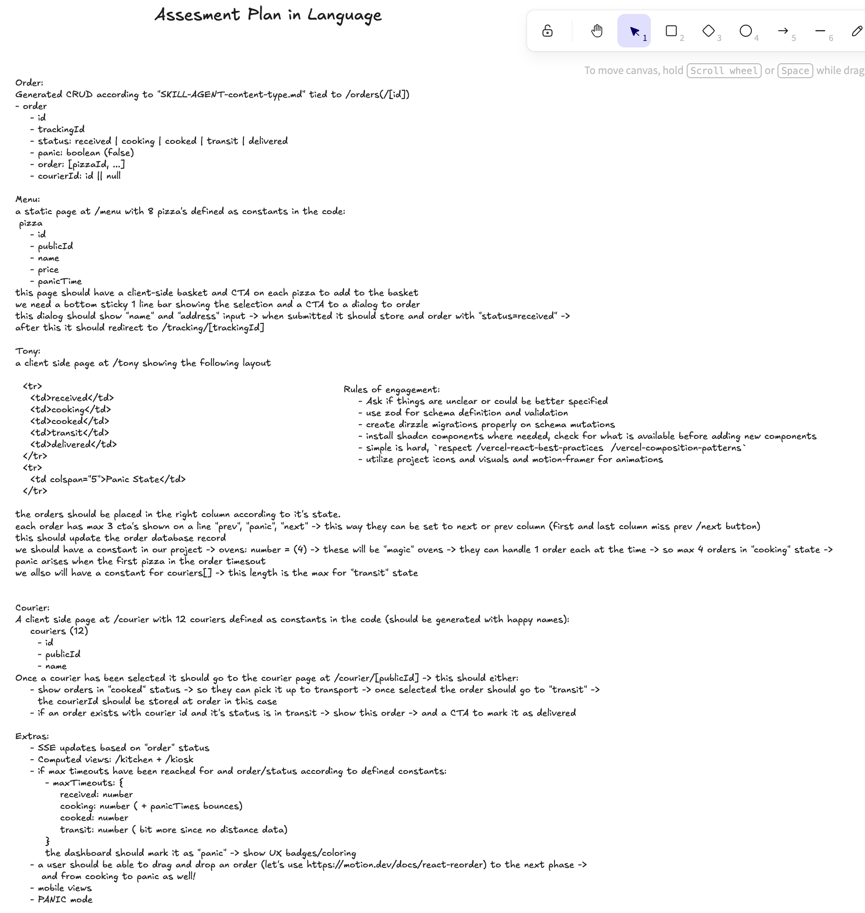
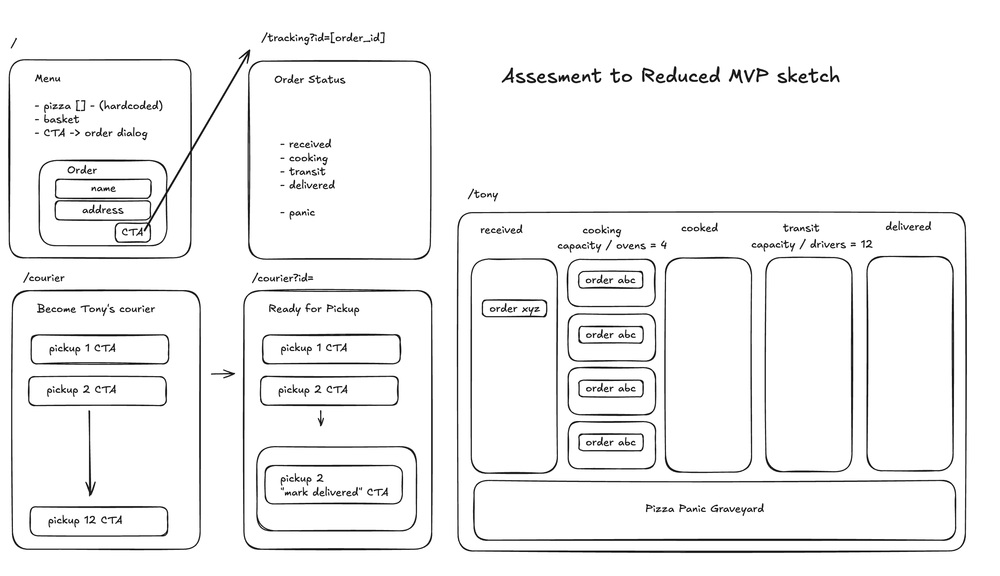
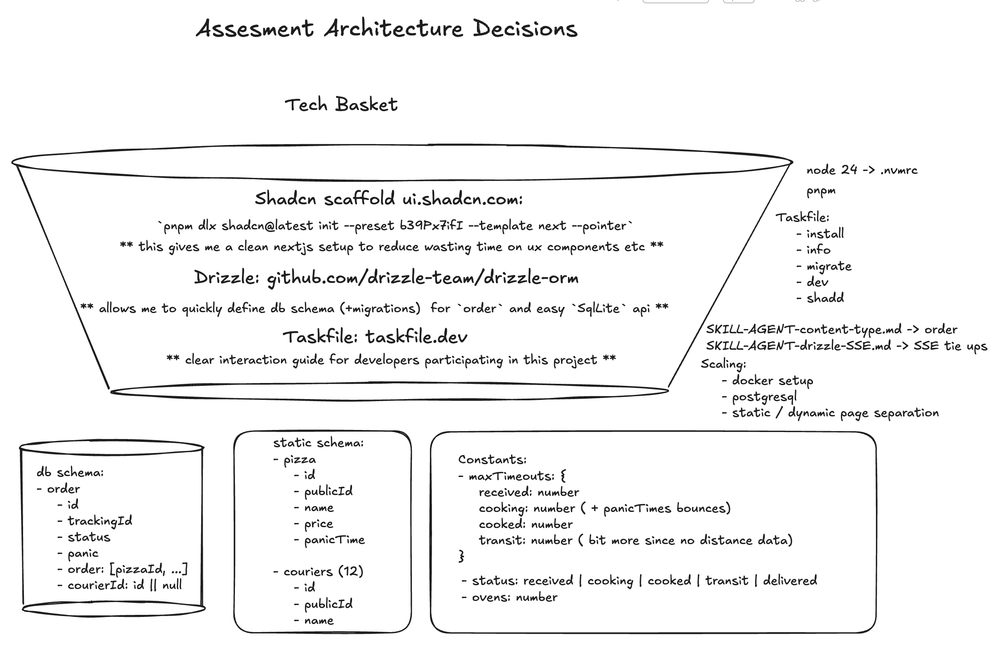

# Pizza Panic

## TL;DR

Pizza Panic is a small Next.js pizza shop operations app: customers order from `/menu`, Tony runs the kitchen at `/tony`, couriers pick up cooked orders from `/courier`, and `/orders` provides the CRUD/admin view.

```sh
corepack enable
corepack pnpm install
corepack pnpm exec drizzle-kit migrate
corepack pnpm dev
```

Then open `http://localhost:3000`.

If you have [Task](https://taskfile.dev/) installed, use the shorter workflow:

```sh
task install
task migrate
task dev
```

## Description

Pizza Panic is a Next.js 16 app built with React 19, Drizzle ORM, SQLite, Tailwind CSS, shadcn-style UI primitives, and Server-Sent Events for order refreshes. The app models a tiny pizza operation:

- Customers build a basket from a fixed pizza menu and submit delivery details.
- Orders move through `received`, `cooking`, `cooked`, `transit`, and `delivered`.
- Tony can move orders forward/back, trigger panic, and manage oven/courier capacity.
- Couriers can claim cooked orders and mark active deliveries as delivered.
- Admin users can inspect, create, update, delete, search, and sort orders.

The local SQLite database lives at `var/pizza-panic.sqlite`.

## Requirements

- Node.js `v24.16.0` from `.nvmrc`
- pnpm via Corepack
- Optional: Taskfile runner, available as the `task` CLI

## Installation

Install the Node version listed in `.nvmrc` with your preferred version manager, then enable Corepack:

```sh
corepack enable
```

Install dependencies:

```sh
corepack pnpm install
```

Create or update the local SQLite database:

```sh
corepack pnpm exec drizzle-kit migrate
```

Start the dev server:

```sh
corepack pnpm dev
```

Open:

```text
http://localhost:3000
```

## Taskfile

This project includes `Taskfile.yml` so common commands are discoverable and repeatable. Task is a command runner; it wraps project commands such as install, migrate, and dev without hiding the underlying pnpm/Drizzle tools.

Install Task from the official docs:

- [Task installation guide](https://taskfile.dev/installation/)

Common tasks:

```sh
task
task install
task migrate
task dev
task shadd -- input table sheet label
```

Task reference:

- `task` shows setup guidance and the task list.
- `task install` runs `corepack pnpm install`.
- `task migrate` creates `var/` and applies Drizzle migrations to SQLite.
- `task dev` starts the Next.js development server.
- `task shadd -- <components>` adds shadcn/ui components.

## Usage Examples

### `/` - Entry Menu

Open the root route to choose the main workflow:

```text
http://localhost:3000/
```

The root menu links to the customer menu, courier chooser, Tony's kitchen board, the global panic button, and the orders admin page.

### `/menu` - Customer Menu

Open:

```text
http://localhost:3000/menu
```

Use the menu to add pizzas to the basket. The sticky bottom bar shows the current selection and total. Click `Order`, enter a name and address, then submit. A successful order redirects to:

```text
/tracking/[trackingId]
```

Pizza options are defined in `lib/pizzas.ts`.

### `/tony` - Kitchen Board

Open:

```text
http://localhost:3000/tony
```

Tony sees orders grouped by status. Each order can move to the previous or next status, or be marked as panic. The board enforces the configured kitchen limits:

- `ovens = 4`
- courier capacity equals the number of configured couriers

Kitchen constants are defined in `lib/kitchen.ts`.

### `/courier` - Courier Flow

Open:

```text
http://localhost:3000/courier
```

Pick one of the configured couriers, then continue to:

```text
/courier/[publicId]
```

If that courier has no active delivery, the courier board shows cooked orders available for pickup. Claiming one moves it to `transit` and assigns the courier. If the courier already has an order in transit, the page shows that delivery and a control to mark it delivered.

### `/orders` - Orders Admin

Open:

```text
http://localhost:3000/orders
```

Use the orders page to create, search, sort, edit, view, and delete orders. The admin list supports URL-backed query params:

```text
/orders?q=received&sort=trackingId&dir=asc
```

Order detail pages live at:

```text
/orders/[id]
```

## Project Scripts

The package scripts are:

```sh
corepack pnpm dev
corepack pnpm build
corepack pnpm start
corepack pnpm lint
corepack pnpm typecheck
corepack pnpm format
```

Use `task --list` for the Taskfile wrappers.

## Data And Migrations

Drizzle is configured in `drizzle.config.ts`.

- Schema: `db/schema.ts`
- Database: `var/pizza-panic.sqlite`
- Migrations: `drizzle/`
- Runtime DB helper: `db/index.ts`

Apply migrations with:

```sh
task migrate
```

or:

```sh
corepack pnpm exec drizzle-kit migrate
```

## Minds

Sketches and planning artifacts are stored in `state/mind/`:







The implementation plan is stored in:

- [state/PLAN-mind.md](state/PLAN-mind.md)

Agent skills and rules of engagement are stored in:

- [state/SKILL-AGENT-content-type.md](state/SKILL-AGENT-content-type.md)
- [state/SKILL-AGENT-drizzle-SSE.md](state/SKILL-AGENT-drizzle-SSE.md)
- [state/rules-of-engagement-human-on-the-loop.md](state/rules-of-engagement-human-on-the-loop.md)

## Prompt History

The prompt history for this project is stored in `state/promptlogs/`.

Current prompt logs:

- [1-orders-crud.md](state/promptlogs/1-orders-crud.md)
- [2-taskfile.md](state/promptlogs/2-taskfile.md)
- [3-menu.md](state/promptlogs/3-menu.md)
- [4-tony.md](state/promptlogs/4-tony.md)
- [5-couriers.md](state/promptlogs/5-couriers.md)
- [6-SSE-mop-up.md](state/promptlogs/6-SSE-mop-up.md)
- [7-panic-timers.md](state/promptlogs/7-panic-timers.md)
- [8-entry-consolidation.md](state/promptlogs/8-entry-consolidation.md)
- [9-readme.md](state/promptlogs/9-readme.md)

## Notes For Agents

Read `AGENTS.md` before editing. This repo is using Next.js 16, and local instructions require reading the relevant guide in `node_modules/next/dist/docs/` before changing Next.js code.

For environment-changing actions such as dependency installs, dev server startup, migrations, Docker, deployment, or credentialed services, follow `state/rules-of-engagement-human-on-the-loop.md`.
